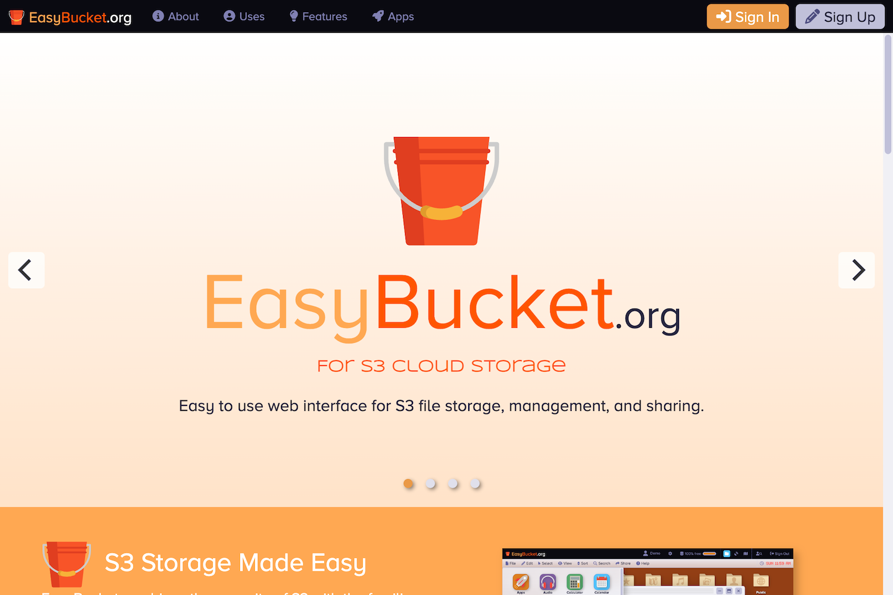
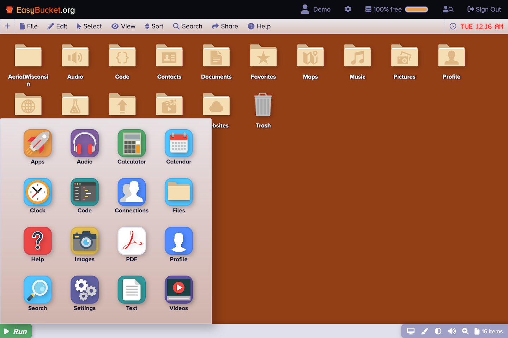

  

    
  

# EasyBucket

EasyBucket is a web platform that allows uploading, managing, and sharing of data.  It combines file sharing and management with a social network and a variety of apps.  It provides an extensive set of tools for viewing, editing, and sharing data in an intuitive desktop-like user interface experience.

Welcome Screen

Desktop

## Features

- Easy and intuitive user interface.
- Store, manage, and view photos and videos.
- Listen to audio and podcasts.
- Run a variety of apps.
- Customizable - by users and site administrators.
- Platform independent - desktop or mobile.
- Self-hostable - run on your own server.

## Benefits

- Manage and your data, documents, photos, music, code and more.
- Allow sharing of your S3 data without sharing your S3 credentials.
- Share data with friends, family, and colleagues.
- Take control of your data.
- Use inexpensive S3 storage to backup your digital life.
- Retain a familiar desktop user experience. 

## Live Demo

You can create an account and explore the features and benefits of the platform at [easybucket.org](https://easybucket.org).

## Installation

Please follow the instructions in [easybucket.org/#installation](https://easybucket.org/#installation) to install the software on your computer or web server.

## Instructions

See the [EasyBucket User Guide](https://easybucket.org/#help) for instructions on how to use the platform.

## License

Distributed under the <a href="https://indiesource.org/">IndieSource License</a> which allows unrestricted use of the software except by very large corporations. See [LICENSE.md](LICENSE.md) for more information.

## Contact

mailto:admin@easybucket.org
